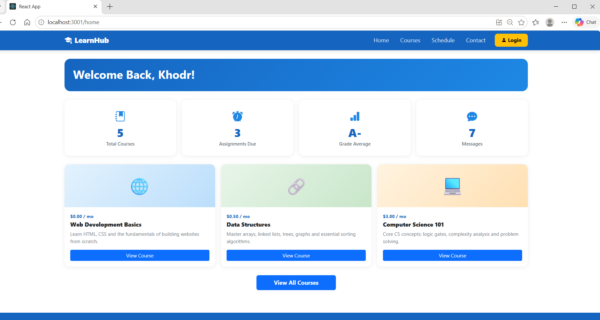
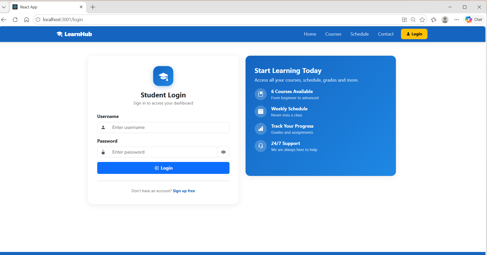
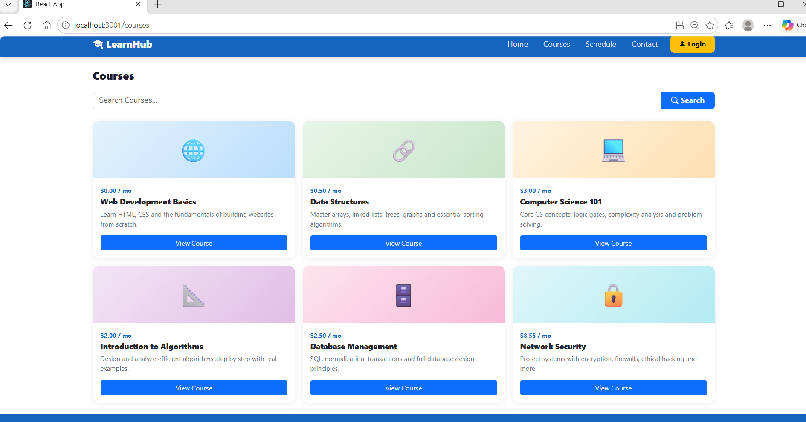
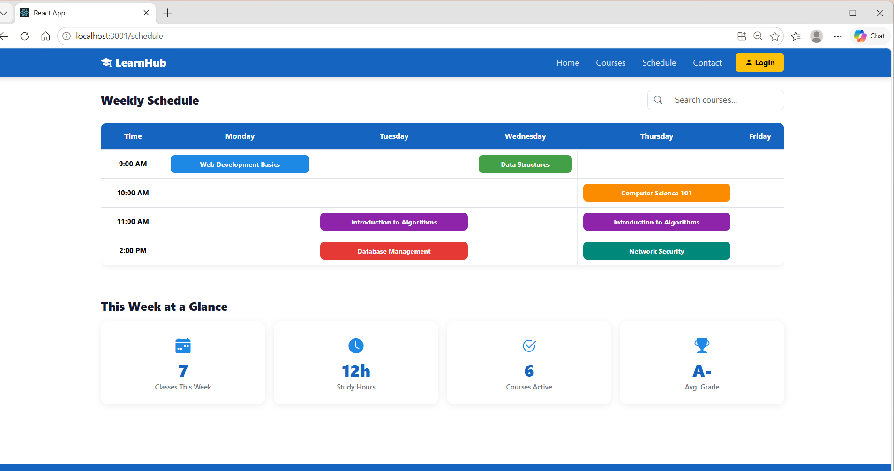
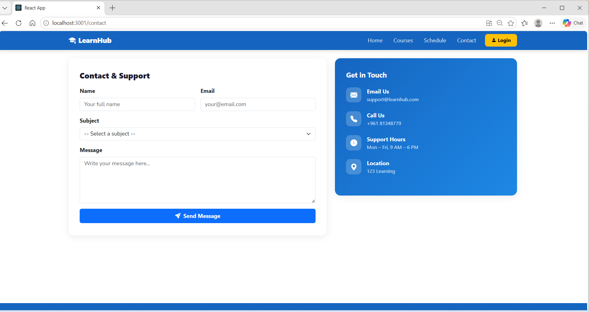

### `npm start`

Runs the app in the development mode.\
Open [http://localhost:3000](http://localhost:3000) to view it in your browser.

The page will reload when you make changes.\
You may also see any lint errors in the console.

### `npm run build`

Builds the app for production to the `build` folder.\
It correctly bundles React in production mode and optimizes the build for the best performance.

The build is minified and the filenames include the hashes.\
Your app is ready to be deployed!

See the section about [deployment](https://facebook.github.io/create-react-app/docs/deployment) for more information.

### `npm run build` fails to minify

This section has moved here: [https://facebook.github.io/create-react-app/docs/troubleshooting#npm-run-build-fails-to-minify](https://facebook.github.io/create-react-app/docs/troubleshooting#npm-run-build-fails-to-minify)
 

  LearnHub — Student Learning Dashboard
A responsive student learning dashboard built with ReactJS and Bootstrap  as part of CSCI390 Web Programming — Project Phase 2.

Project Description:
LearnHub is a frontend web application that allows students to manage their academic life from one place. It includes a home dashboard, courses listing with search, a weekly schedule, a contact form, and a login page. The project is fully responsive and works on desktop, tablet, and mobile screens.

Features:
Home Dashboard — Welcome banner, stat cards (Total Courses, Assignments Due, Grade Average, Messages), and a preview of enrolled courses
Courses Page — All 6 courses displayed with a live search/filter using React useState and filter()
Schedule Page — Weekly timetable with color-coded class slots and a search filter that dims non-matching slots
Contact Page — Contact form with full validation (name, email, subject, message) and a Get in Touch info panel
Login Page — Student login with username/password validation, show/hide password toggle, and redirect on success

 Technologies Used:
 ReactJS: Frontend library — components, useState, routing
 React Router DOM: Page navigation with Link, Routes, Route
 Bootstrap:Responsive grid and UI components
 CSS: Custom styling — Flexbox, variables, hover effects

project structure:

 src/
 App.js                   Main app with routing
 index.js                 Entry point with BrowserRouter
 components/
    Navbar.js            Navigation bar with Link
    StatCard.js          Reusable stat card component
    CourseCard.js        Reusable course card with modal
    coursesData.js       All courses data array
pages/
    Home.js              Dashboard page
    Courses.js           Courses page with search
    Schedule.js          Weekly schedule page
    Contact.js           Contact form page
    Login.js             Login page
 styles/
     style.css            All custom styles

     Setup Instructions:
     -Node.js installed
     -npm installed

     steps:

     git clone https://github.com/khodrabbass/studentdashboard.git

     cd studentdashboard

     npm install

     npm start

    login credentials:
    username :khodr
    password:1234

   ## Screenshots

### Homepage

### Loginpage

### Coursespage

### Schedulepage

### Contactpage

git add khodrwebphase2/*.png README.md
git commit -m "Added screenshots to README"
git push

